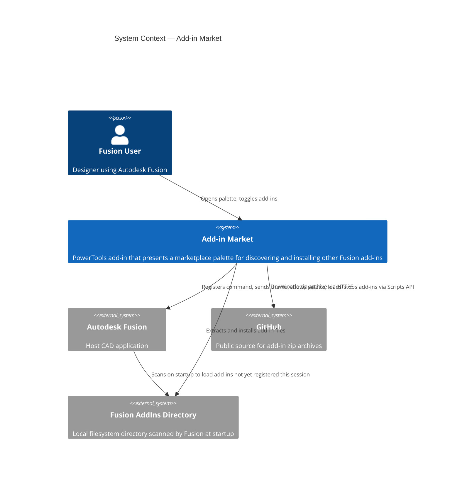
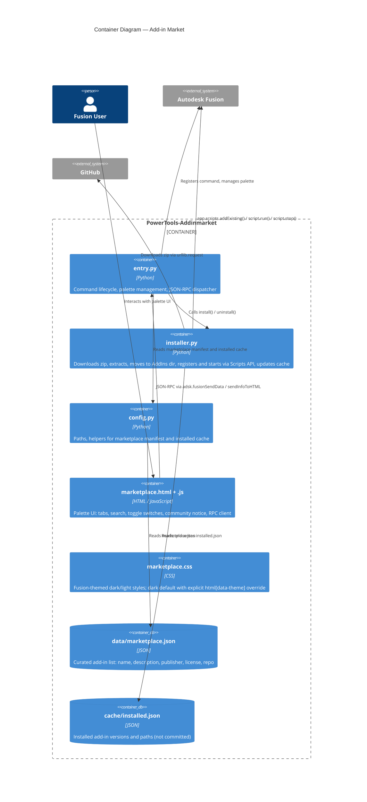
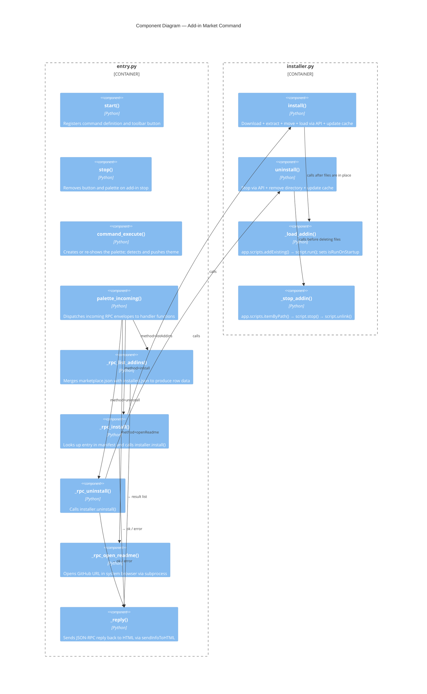
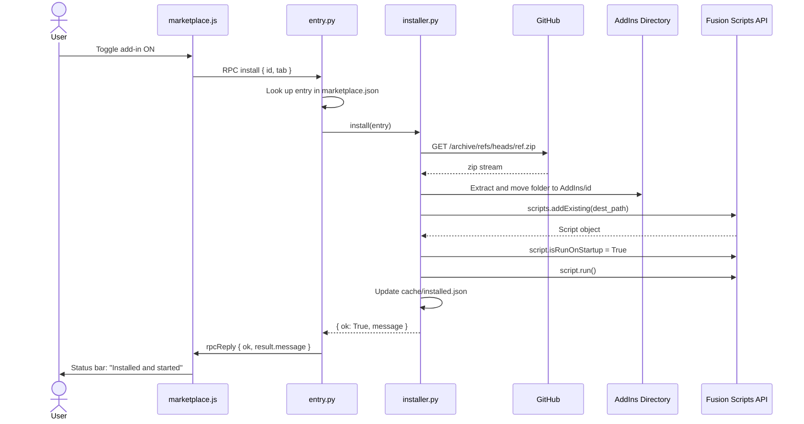
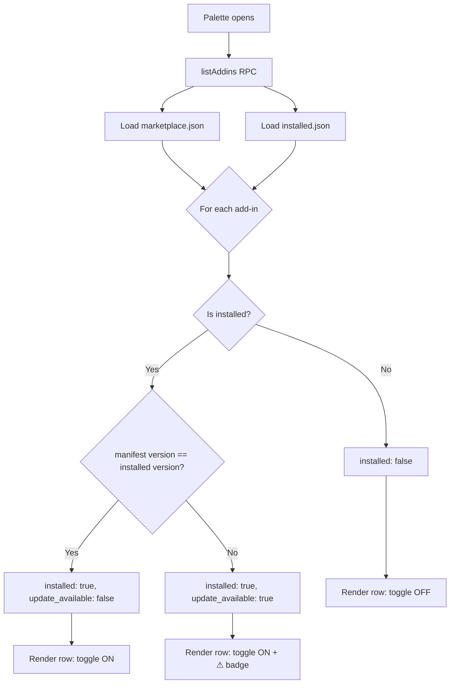

# Add-in Market

[Back to README](../README.md)

## Overview

The **Add-in Market** command opens a floating palette that serves as a curated in-app marketplace for Autodesk Fusion add-ins. Users can browse, search, and install add-ins from two categories — Core Plugins (officially maintained add-ins) and Community Plugins (contributed by the broader Fusion community) — directly from GitHub without leaving Fusion.

Installed add-ins are registered with Fusion's Scripts API and started immediately. No restart or manual activation is required.

## Prerequisites

- An Autodesk Fusion design document must be open.
- An active internet connection is required to download add-ins.
- Sufficient disk space in `~/Library/Application Support/Autodesk/Autodesk Fusion 360/API/AddIns/` (macOS) or `%APPDATA%\Autodesk\Autodesk Fusion 360\API\AddIns\` (Windows).

## Access

The **Add-in Market** command is available in Fusion's **Tools** tab, in the **Power Tools** panel.

1. Open Autodesk Fusion with any document.
2. Select the **Tools** tab in the toolbar.
3. In the **Power Tools** panel, click **Add-in Market**.

## How to Use

### Opening the marketplace

1. Click **Add-in Market** in the Power Tools panel.
2. The marketplace palette opens, defaulting to the **Core Plugins** tab.

### Browsing add-ins

- Each row displays the add-in name, version, publisher, license, and description.
- Switch between **Core Plugins** and **Community Plugins** using the tab buttons at the top.
- Community plugin rows include an **Open on GitHub** link that opens the add-in's readme in your default browser.

### Community add-in notice

When the **Community Plugins** tab is active, a notice appears at the bottom of the palette:

> Community add-ins are third-party software. Review their source code before installing.

Community add-ins are not vetted by IMA LLC. Always review an add-in's source code and readme before installing it.

### Searching and filtering

- Type in the **Search add-ins** field to filter the list by name, description, or publisher. Results update after a short pause.
- Enable the **Installed only** checkbox to show only add-ins currently installed on your machine.

### Installing an add-in

1. Locate the add-in you want to install.
2. Click its toggle switch to turn it **on**.
3. The status bar shows download progress.
4. When complete, the add-in is registered with Fusion and started immediately — its commands and panels are available straight away without restarting Fusion.

> If the add-in cannot be started automatically (for example, it has a malformed manifest), the status bar will prompt you to activate it manually via **Utilities → Add-Ins**.

### Removing an add-in

1. Locate an installed add-in (toggle is **on**).
2. Click its toggle switch to turn it **off**.
3. The add-in is stopped, its files are removed from the AddIns directory, and the cache is updated. No manual intervention is required.

### Version notifications

When the marketplace manifest is updated with a new version of an add-in you have installed, an **⚠ Update available** badge appears on that add-in's row. To update:

1. Toggle the add-in **off** to stop and uninstall the current version.
2. Toggle it **on** to download, install, and start the new version.

No Fusion restart is required — the updated add-in is loaded live in the current session.

## Expected Results

- The **Core Plugins** tab lists all add-ins from the `core` section of `data/marketplace.json`.
- The **Community Plugins** tab lists all add-ins from the `community` section, with a notice reminding users to review third-party code before installing.
- Toggling an add-in on downloads the repository zip, extracts it, places it in the Fusion AddIns directory, and starts it live in the current session.
- The add-in is configured to run on startup automatically for all future Fusion sessions.
- The toggle state persists across palette sessions via `cache/installed.json`.
- The **⚠ Update available** badge appears when the manifest version differs from the installed version.

## Limitations

- **No automatic updates.** Updates must be applied manually (toggle off, then on) to avoid loading conflicts.
- **GitHub branch archives only.** Downloads pull the branch specified by `download_ref` in `marketplace.json`. Add-ins that do not publish a stable branch may not install correctly.
- **No signature verification.** Downloaded zip archives are not cryptographically verified. Only install add-ins from publishers you trust.

---

## Architecture

### System context

### Container diagram

### Component diagram

### Install sequence

### Update notification workflow

---

[Back to README](../README.md)

*Copyright © 2026 IMA LLC. All rights reserved.*
