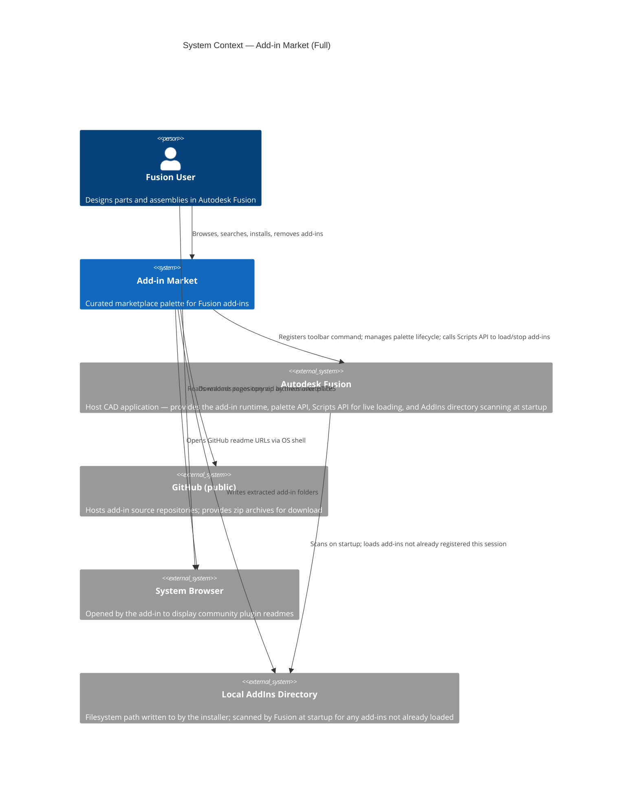
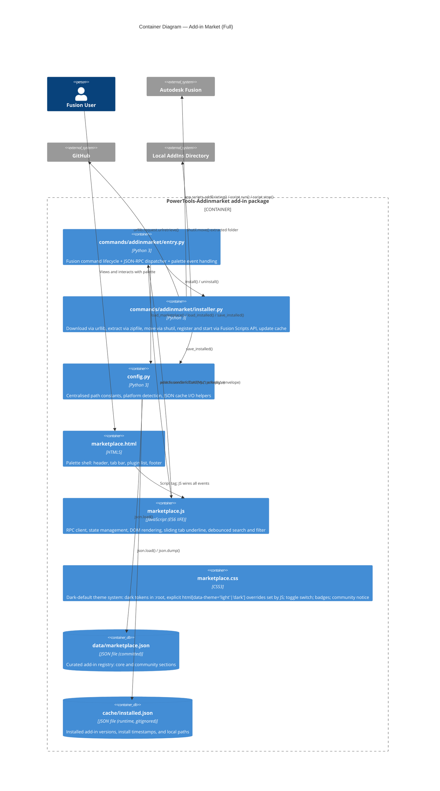
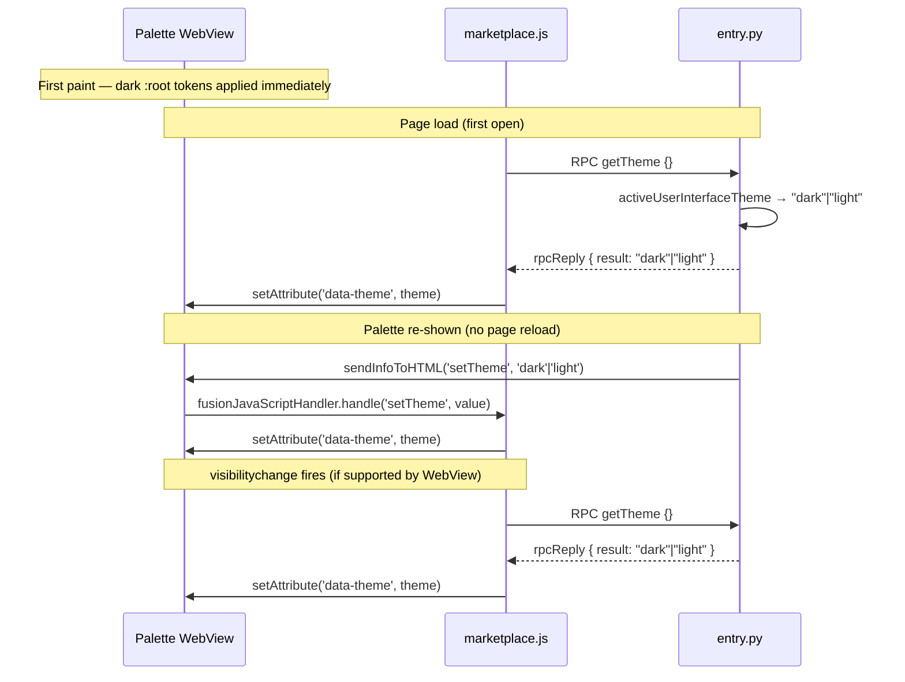

# Add-in Market — Architecture Reference

[Back to README](../README.md)

This document provides a full technical reference for the Add-in Market add-in. It covers the system context, container and component decomposition, data model, key flows, and operational considerations.

---

## 1. System Context

Add-in Market operates entirely within the user's local machine. It does not maintain a backend service. The marketplace manifest (`data/marketplace.json`) is a static file shipped with the add-in and updated by the maintainer via commits to this repository. Add-in archives are fetched from GitHub at install time. After installation, the add-in is registered with Fusion's Scripts API and started live in the current session — no restart is required.



---

## 2. Container Decomposition



---

## 3. Data Model

### `data/marketplace.json`

Curated and committed. Updated manually when new add-ins are added or versions change.

```
{
  "schema_version": "1.0",
  "updated": "<ISO date>",
  "core": [ <AddinEntry>, ... ],
  "community": [ <AddinEntry>, ... ]
}

AddinEntry {
  id           string   Unique identifier; also used as the installed folder name
  name         string   Human-readable display name
  description  string   One-line description shown in the marketplace
  publisher    string   Organization or individual responsible for the add-in
  license      string   SPDX license expression (e.g. "GPL-3.0-or-later")
  github_repo  string   "owner/repo" slug used to build the download URL
  version      string   Current version string (semver recommended)
  download_ref string   Git branch or tag to download (e.g. "main", "v1.2.0")
  readme_url   string?  Full URL to the readme page on GitHub (required for community; optional for core)
}
```

### `cache/installed.json`

Runtime-only, gitignored. Created and maintained by the add-in.

```
{
  "<addin-id>": {
    "version":      string   Version string at time of install
    "installed_at": string   ISO 8601 timestamp
    "path":         string   Absolute path to the installed folder
  }
}
```

---

## 4. JSON-RPC Bridge

Fusion's HTML palette communicates with Python over two synchronous hooks:

| Direction | Mechanism |
|-----------|-----------|
| JS → Python | `adsk.fusionSendData(action, dataString)` |
| Python → JS | `palette.sendInfoToHTML(action, dataString)` |

The add-in layers a simple Promise-based RPC protocol on top:

**Request envelope (JS → Python, action = `"rpc"`)**
```json
{ "id": 1, "method": "listAddins", "params": { "tab": "core" } }
```

**Reply envelope (Python → JS, action = `"rpcReply"`)**
```json
{ "id": 1, "ok": true, "result": [ ... ] }
{ "id": 1, "ok": false, "error": "message" }
```

### RPC methods

| Method | Params | Returns |
|--------|--------|---------|
| `listAddins` | `{ tab: "core"\|"community" }` | `AddinRow[]` — merged manifest + installed state |
| `install` | `{ id, tab }` | `{ ok, message }` |
| `uninstall` | `{ id }` | `{ ok }` |
| `openReadme` | `{ url }` | `{ ok }` |

**`AddinRow` (returned by `listAddins`)**

All `AddinEntry` fields plus:

| Field | Type | Description |
|-------|------|-------------|
| `installed` | bool | True if recorded in installed.json |
| `installed_version` | string\|null | Version string at time of install |
| `update_available` | bool | True when `installed_version != version` and add-in is installed |

---

## 5. Install Flow Detail

```mermaid
flowchart LR
    A[JS: toggle ON] --> B[RPC install]
    B --> C[entry.py: look up entry in manifest]
    C --> D[installer.install entry]
    D --> E[Build URL: github.com/owner/repo/archive/refs/heads/ref.zip]
    E --> F[urllib.request.urlretrieve to temp file]
    F --> G[zipfile.ZipFile.extractall to temp dir]
    G --> H[Identify single top-level folder]
    H --> I{Existing install at dest?}
    I -- Yes --> J[shutil.rmtree existing]
    I -- No --> K[skip]
    J --> L[shutil.move extracted root to AddIns/addin_id]
    K --> L
    L --> M[_load_addin: scripts.addExisting + script.run]
    M --> N[config.save_installed: update cache]
    N --> O[Return ok + message to JS]
    O --> P[JS: update toggle state + show status]
```



### Live loading via Fusion Scripts API

After the files are in place, `_load_addin()` registers and starts the add-in in the current session:

```python
scripts = adsk.core.Application.get().scripts

# Re-use existing Script object if Fusion already knows this path
script = scripts.itemByPath(dest_path) or scripts.addExisting(dest_path)

script.isRunOnStartup = True   # persist across future sessions
script.run()                   # start immediately, no restart needed
```

If the API call fails for any reason (e.g. malformed manifest), the error is logged and install still succeeds — files are on disk and Fusion will discover them on the next startup.

### Uninstall flow

`_stop_addin()` is called before the folder is deleted:

```python
script = app.scripts.itemByPath(dest_path)
if script.isRunning:
    script.stop()
script.unlink()   # removes from linked list; ignored if standard-location add-in
```

---

## 6. Theme Detection

Theme is read from Fusion's own preference API and applied to the palette via two cooperating mechanisms: a Python push on every show, and a JS pull on every page load and palette re-show.

### Python: reading Fusion's theme

```python
def _fusion_theme() -> str:
    try:
        theme = app.preferences.generalPreferences.activeUserInterfaceTheme
        _dark = {
            adsk.core.UserInterfaceThemes.DarkBlueUserInterfaceTheme,
            adsk.core.UserInterfaceThemes.DarkGrayUserInterfaceTheme,
        }
        return "dark" if theme in _dark else "light"
    except Exception:
        return "dark"
```

`activeUserInterfaceTheme` (introduced January 2026) resolves Fusion's "follow device" setting to the actual applied theme before comparison. The `UserInterfaceThemes` enum values are:

| Constant | Value | Resolved theme |
| -------- | ----- | -------------- |
| `ClassicUserInterfaceTheme` | 0 | light |
| `LightGrayUserInterfaceTheme` | 1 | light |
| `DarkBlueUserInterfaceTheme` | 2 | dark |
| `DarkGrayUserInterfaceTheme` | 3 | dark |
| `DeviceUserInterfaceTheme` | 4 | resolved by `activeUserInterfaceTheme` |

### CSS: dark default

`:root` declares dark tokens. There is no `@media (prefers-color-scheme)` rule — it is unreliable in Fusion's embedded WebView. `html[data-theme="light"]` and `html[data-theme="dark"]` are the only overrides, set exclusively by JS.

### Theme application sequence



**Theme delivery layers (first match wins):**

| Trigger | Mechanism | Covers |
| ------- | --------- | ------ |
| First paint | `:root` dark tokens (CSS default) | Instant; no JS or Python needed |
| Page load | `getTheme` RPC pull in `boot()` | First open; page reload |
| Palette re-show | `sendInfoToHTML('setTheme', ...)` push from Python | Re-open without page reload |
| Palette re-show | `visibilitychange` listener → `getTheme` RPC | Backup when push arrives before JS is ready |

---

## 7. File Layout Reference

```
PowerTools-Addinmarket/
├── PowerTools-Addinmarket.manifest    Fusion add-in registration
├── PowerTools-Addinmarket.py          run() / stop() entry point
├── config.py                          paths, platform helpers, JSON I/O
├── LICENSE                            GPL-3.0-or-later
├── README.md                          User-facing documentation
├── .gitignore
├── .env                               Local PYTHONPATH for dev tools
├── .vscode/launch.json                Debug attach configuration
├── commands/
│   ├── __init__.py                    Command registry: start / stop
│   └── addinmarket/
│       ├── __init__.py
│       ├── entry.py                   Command lifecycle + RPC dispatcher
│       ├── installer.py               Download / extract / load via API / remove
│       └── resources/
│           ├── 16x16.png                  Toolbar icon (light theme)
│           ├── 16x16-dark.png             Toolbar icon (dark theme)
│           ├── 32x32.png                  Toolbar icon HiDPI (light theme)
│           ├── 32x32-dark.png             Toolbar icon HiDPI (dark theme)
│           ├── 64x64.png                  Toolbar icon 2× HiDPI (light theme)
│           ├── 64x64-dark.png             Toolbar icon 2× HiDPI (dark theme)
│           ├── Arch_AWS-Marketplace_Dark_16.svg   Source SVG 16px
│           ├── Arch_AWS-Marketplace_Dark_32.svg   Source SVG 32px
│           ├── Arch_AWS-Marketplace_Dark_64.svg   Source SVG 64px
│           └── palette/
│               ├── marketplace.html   Palette shell
│               ├── marketplace.css    Dark-default theme; html[data-theme] overrides
│               └── marketplace.js     RPC client + DOM rendering + theme application
├── data/
│   └── marketplace.json               Curated add-in manifest (committed)
├── cache/
│   ├── .gitkeep                       Keeps the directory in git
│   └── installed.json                 Runtime state (gitignored)
├── lib/
│   └── fusionAddInUtils/              Vendored Autodesk sample utilities
│       ├── __init__.py
│       ├── event_utils.py
│       └── general_utils.py
└── docs/
    ├── AddinMarket.md                 User guide + C4 + sequence diagrams
    └── architecture.md               This document
```

---

## 8. Operational Notes

### Adding new add-ins to the marketplace

1. Open `data/marketplace.json`.
2. Add a new `AddinEntry` object to the `core` or `community` array.
3. Set `version` to the current release tag and `download_ref` to the branch or tag to archive.
4. For community entries, populate `readme_url` with the GitHub readme anchor.
5. Update the top-level `updated` field.
6. Commit and push. Users will see the new add-in the next time they open the palette.

### Publishing an update

1. Increment `version` in the add-in's `AddinEntry` in `marketplace.json`.
2. Commit and push.
3. Users who already have the add-in installed will see the **⚠ Update available** badge.

### Platform paths

| Platform | AddIns directory |
|----------|-----------------|
| macOS | `~/Library/Application Support/Autodesk/Autodesk Fusion 360/API/AddIns/` |
| Windows | `%APPDATA%\Autodesk\Autodesk Fusion 360\API\AddIns\` |

`config.fusion_addins_dir()` returns the correct path for the current platform at runtime.

---

[Back to README](../README.md)

*Copyright © 2026 IMA LLC. All rights reserved.*
